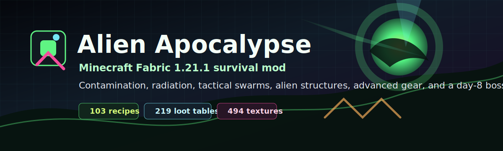
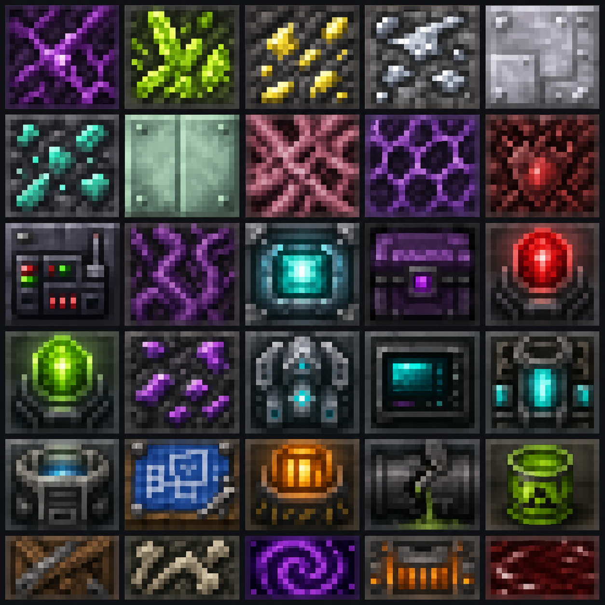

<div align="center">



<p>
  <b>🇬🇧 English</b>
  &nbsp;·&nbsp;
  <a href="README.ru.md">🇷🇺 Русский</a>
</p>

<p>
  <a href="https://github.com/physicaldazezzz/binary-gravity/actions/workflows/build.yml"></a>
  
  
  
  
  
</p>

<h3>Survive a staged alien apocalypse — contamination spreads, radiation becomes logistics, swarms learn to hunt you, and day&nbsp;8 brings a boss.</h3>

<p>
  <a href="#overview">Overview</a> ·
  <a href="#the-eight-day-invasion">The invasion</a> ·
  <a href="#features">Features</a> ·
  <a href="#install">Install</a> ·
  <a href="#build-from-source">Build</a> ·
  <a href="#contributing">Contribute</a>
</p>

</div>

---

## Overview

**Alien Apocalypse** is a single-player and multiplayer survival mod for **Minecraft Fabric 1.21.1**. It turns a normal world into a war zone on a timer: the longer you live, the harder the sky presses down. Infection creeps across the ground, radioactive storms make the surface a logistics puzzle, and the swarm stops behaving like loot piñatas and starts behaving like an army — flanking, tunnelling, bombing, building, fleeing, and coordinating.

Everything is connected by one rule: **every block, mob, and material has a source, a use, and a purpose.** Materials lead to gear, gear answers a specific threat, and the strongest rewards are gated behind the hardest fights — culminating in a **day‑8 boss** that ends the invasion when you finally beat it.

> [!NOTE]
> The GitHub repository is `binary-gravity`, the Gradle project is `alien-invasion`, and the in‑game mod name is **Alien Apocalypse**.

---

## The eight-day invasion

Pressure escalates on a schedule. The in‑game HUD and `/invasion` command read out the current phase.

| Day | Phase | What lands on you | What you should be doing |
| :--: | :-- | :-- | :-- |
| **1** | 🛰️ **Recon** | Scouts probe the perimeter — grunts, trolls, alien chickens | Dig in, fortify, secure first food and tools |
| **2–4** | ⚔️ **Assault** | Brutes and casters push in; orbital strikes drop meteors and laser drills | Build hazmat / chitin gear, set up counters |
| **5+** | ☢️ **Total war** | Radioactive storms roll across the surface | Go deep, mine cosmic ore, chase top‑tier gear |
| **8** | 💀 **Swarm Mother** | Craft the **Swarm Beacon**, summon her, and finish it | Bring apex weapons — this is the campaign's end |

---

## Features

- 🌐 **Staged invasion pacing** — world events, swarm escalation, infection spread, radiation, and acid rain tied to a day‑by‑day timeline.
- 🧠 **Tactical alien AI** — flanking, retreating, tunnelling, bombing runs, bridge building, squad aggro, scavenging, teleport pressure, and hive behaviour.
- ☣️ **Contamination as progression** — radiation needs protection, infection needs cleansing, machines need EMP. Counters, not raw power, carry you forward.
- 🛡️ **Adaptive swarm** — as the days climb, the swarm learns to pierce ordinary armor (vanilla gear always blocks *something*, but never makes you immune). Alien‑grade mod armor shrugs the adaptation off — so it stays the real goal.
- 🏚️ **World content** — alien cities, hives, crashed UFOs, labs, bunkers, vaults, residue veins, and a hostile homeworld dimension.
- 🔫 **An arsenal with intent** — blasters, gravity weapons, EMP grenades, plasma and cosmic gear, Nibirium tools, palladium/platinum anvils, and boss‑gated apex weapons.
- ✨ **Client polish** — custom entity models and renderers, armor models, a HUD overlay, particles, ambience, full `en_us` + `ru_ru` localization, and **JEI** recipe integration.

---

## The Swarm

A field guide to a few of the things that want your base gone. The swarm spans light recon, heavy assault, casters, fliers, machines, and infested versions of familiar mobs.

<details>
<summary><b>Open the bestiary</b></summary>

<br>

| Threat | Role | Notable behaviour |
| :-- | :-- | :-- |
| Alien Grunt | Light infantry | Backbone of recon waves |
| Alien Troll | Raider | Steals items and runs |
| Alien Brute | Heavy assault | Pushes lines, soaks damage |
| Alien Breacher | Sapper | Opens fortifications |
| Alien Raptor | Skirmisher | Fast, leaping flanker |
| Cave Lurker | Ambusher | Bespoke ambush‑spider with bioluminescent eyes that glow in the dark |
| Acid Spitter | Ranged | Lobs corrosive bolts |
| Plasma Caster | Ranged | Plasma fire at distance |
| Telekinetic Alien | Caster | Teleport / displacement pressure |
| Hive Shaman | Support | Buffs and sustains the swarm |
| Sky Drone / UFO | Air | Orbital scouting and strafing |
| Laser Drill | Machine | A destructible orbital breach‑drill — shoot it (or EMP then break it) to cancel the breach before the squad lands |
| Infested Zombie / Skeleton / Creeper / Worm | Infested | Corrupted vanilla mobs |
| **Hive Tyrant** | **Mini‑boss** | Gate‑keeper of deep structures |
| **Swarm Mother** | **Day‑8 boss** | Summoned via the Swarm Beacon — beat her to end the invasion |

</details>

---

## Threat and answer

The mod's design backbone: **every threat has a deliberate counter.** Power scales with the difficulty of the obstacle it answers, not with a single cheap material.

| Threat | Your answer |
| :-- | :-- |
| ☢️ Radiation fields & storms | Hazmat suit (full set = immune), bio‑filter mask, rad pills, portable purifier |
| 🦠 Infection & contaminated ground | Chitin gear (clears infection), cosmic armor (immune + walks alien blocks), bio‑shovel |
| 🐝 Swarms & crowds | Cosmic Warhammer (slam CC), Star Cleaver (cleave), plasma / iridium weapons |
| 🛡️ Armor‑piercing adaptation | Alien‑grade mod armor (hazmat, chitin, cosmic) keeps blocking when vanilla gear is learned around |
| 🤖 Machines (drills, gravity guns) | EMP grenade |
| 💎 Apex crafting | Deep radioactive mining + dark‑matter cores + structure/boss drops feed `bio_blade`, the strongest weapon |

---

## Content at a glance

| Area | Footprint |
| :-- | --: |
| Recipes | **103** |
| Loot tables | **219** |
| Worldgen JSON files | **33** |
| Advancements | **15** |
| Block / item models | **615** |
| Texture files | **493** |
| Languages | `en_us`, `ru_ru` |
| Target Minecraft | `1.21.1` |
| Java target | `21` |

---

## Gallery

<table>
  <tr>
    <td width="34%" align="center">
      <br>
      <sub><b>Mod icon</b><br>Readable identity for launchers and mod lists.</sub>
    </td>
    <td width="66%" align="center">
      <br>
      <sub><b>Block art direction</b><br>Contaminated machinery, organic residue, warning lights, and sci‑fi survival surfaces.</sub>
    </td>
  </tr>
</table>

> Art direction follows the project's [visual identity](docs/BRAND.md) — “Incursion Report”: signal‑green readings against the void, hazard amber for real danger.

---

## Requirements

- Minecraft **1.21.1**
- Fabric Loader **0.17.2** or newer
- Fabric API **0.116.8+1.21.1**
- Java **21**
- **JEI** is optional, for browsing recipes in‑game

---

## Install

1. Install Minecraft **1.21.1** with **Fabric Loader**.
2. Install **Fabric API** for 1.21.1.
3. Drop the built `alien-invasion-*.jar` into your `mods` folder.
4. Launch the game and look for **Alien Apocalypse** in the mod list.

> This repository does not pretend a release exists before one is published. If there is no GitHub Release yet, **build from source** below.

---

## Build from source

**Windows**

```powershell
.\gradlew.bat build
```

**Linux / macOS**

```bash
chmod +x ./gradlew
./gradlew build
```

The remapped mod jar is written to `build/libs/`.

---

## Repository map

| Path | Purpose |
| :-- | :-- |
| `src/main/java/com/example/alieninvasion` | Mod source — AI, blocks, items, entities, worldgen hooks, renderers, systems |
| `src/main/resources/assets/alien-invasion` | Textures, models, lang files, particles, client assets |
| `src/main/resources/data/alien-invasion` | Recipes, loot tables, advancements, dimensions, worldgen, tags |
| `docs/DESIGN.md` | Design rules for progression and content causality |
| `docs/CONTENT_LEDGER.md` | Content ledger and backlog verdicts |
| `docs/BRAND.md` | Visual identity, palette, and banner philosophy |
| `docs/GITHUB_SETUP.md` | Repo settings that can't live in files (topics, description, social preview) |
| `tools/` | Maintenance scripts for localization and generated art assets |

---

## Contributing

- Keep new content connected to **acquisition, usage, and purpose** — a material with no downstream use is debt, not depth.
- Prefer meaningful counters over power creep: radiation needs protection, swarms need crowd control, machines need EMP.
- Run `.\gradlew.bat build` before opening a pull request.
- Update `en_us.json` and `ru_ru.json` together whenever you add player‑facing text.
- See [`CONTRIBUTING.md`](CONTRIBUTING.md), [`SECURITY.md`](SECURITY.md), and [`docs/DESIGN.md`](docs/DESIGN.md) for the full picture.

---

## License

The mod metadata declares **`CC0‑1.0`**, and this repository ships the matching `LICENSE` file. If that is not the intended license for the code and art, change both `LICENSE` and `src/main/resources/fabric.mod.json` before publishing releases.

<div align="center">
<br>
<sub>They came for our world. <b>Survive.</b> · Made with Fabric for Minecraft 1.21.1</sub>
</div>
