<div align="center">



<p>
  <a href="README.md">🇬🇧 English</a>
  &nbsp;·&nbsp;
  <b>🇷🇺 Русский</b>
</p>

<p>
  <a href="https://github.com/physicaldazezzz/binary-gravity/actions/workflows/build.yml"></a>
  
  
  
  
  
</p>

<h3>Переживите поэтапный апокалипсис: заражение расползается, радиация превращается в логистику, рой учится охотиться, а на 8‑й день приходит босс.</h3>

<p>
  <a href="#обзор">Обзор</a> ·
  <a href="#восьмидневное-вторжение">Вторжение</a> ·
  <a href="#возможности">Возможности</a> ·
  <a href="#установка">Установка</a> ·
  <a href="#сборка-из-исходников">Сборка</a> ·
  <a href="#как-помочь-проекту">Помощь</a>
</p>

</div>

---

## Обзор

**Alien Apocalypse** — мод выживания для **Minecraft Fabric 1.21.1**, для одиночной и сетевой игры. Он превращает обычный мир в зону боевых действий с таймером: чем дольше вы живы, тем сильнее давит небо. Заражение расползается по земле, радиоактивные штормы превращают поверхность в логистическую головоломку, а рой перестаёт быть мешком с лутом и начинает вести себя как армия — обходит с флангов, роет туннели, бомбит, строит мосты, отступает и координирует атаки.

Всё связано одним правилом: **у каждого блока, моба и материала есть источник, применение и назначение.** Материалы ведут к снаряжению, снаряжение отвечает на конкретную угрозу, а лучшие награды спрятаны за самыми тяжёлыми боями — вплоть до **босса 8‑го дня**, с победой над которым вторжение заканчивается.

> **Названия.** Репозиторий на GitHub называется `binary-gravity`, проект Gradle — `alien-invasion`, а имя мода в игре — **Alien Apocalypse**.

---

## Восьмидневное вторжение

Давление растёт по расписанию. Текущую фазу показывают HUD в игре и команда `/invasion`.

| День | Фаза | Что прилетает | Чем стоит заняться |
| :--: | :-- | :-- | :-- |
| **1** | 🛰️ **Разведка** | Разведотряды прощупывают периметр — солдаты, троли, инопланетные куры | Окопаться, укрепиться, добыть первую еду и инструменты |
| **2–4** | ⚔️ **Штурм** | Громилы и кастеры идут на прорыв; с орбиты падают метеоры и лазерные буры | Собрать химзащиту / хитин, выставить контрмеры |
| **5+** | ☢️ **Тотальная война** | По поверхности гуляют радиоактивные штормы | Уходить вглубь, добывать космическую руду, гнаться за топ‑снаряжением |
| **8** | 💀 **Мать Роя** | Скрафтить **Маяк Роя**, призвать её и закончить это | Принести апекс‑оружие — это финал кампании |

---

## Возможности

- 🌐 **Поэтапный темп вторжения** — мировые события, эскалация роя, заражение, радиация и кислотные дожди, привязанные к таймлайну по дням.
- 🧠 **Тактический ИИ пришельцев** — фланги, отступления, рытьё туннелей, бомбардировки, постройка мостов, агро отрядами, мародёрство, телепорт‑давление и поведение улья.
- ☣️ **Заражение как прогрессия** — радиации нужна защита, заражению — очистка, технике — ЭМИ. Вперёд ведут контрмеры, а не голая сила.
- 🛡️ **Адаптивный рой** — с каждым днём рой учится пробивать обычную броню (ванильная всегда что‑то блокирует, но иммунитета не даёт). Инопланетная броня мода сбрасывает эту адаптацию — поэтому именно она и есть цель.
- 🏚️ **Контент мира** — города Роя, ульи, разбитые НЛО, лаборатории, бункеры, хранилища, жилы слизи и враждебный родной мир Роя.
- 🔫 **Арсенал со смыслом** — бластеры, гравитационное оружие, ЭМИ‑гранаты, плазменное и космическое снаряжение, нибириевые инструменты, палладиевая/платиновая наковальни и апекс‑оружие за боссом.
- ✨ **Клиентский лоск** — собственные модели и рендереры мобов, модели брони, HUD‑оверлей, частицы, эмбиент, полная локализация `en_us` + `ru_ru` и интеграция рецептов **JEI**.

---

## Рой

Краткий определитель тех, кто хочет стереть вашу базу. Рой охватывает лёгкую разведку, тяжёлый штурм, кастеров, авиацию, технику и заражённые версии знакомых мобов.

<details>
<summary><b>Открыть бестиарий</b></summary>

<br>

| Угроза | Роль | Поведение |
| :-- | :-- | :-- |
| Пришелец‑солдат | Лёгкая пехота | Костяк разведволн |
| Пришелец‑троль | Налётчик | Крадёт предметы и убегает |
| Пришелец‑громила | Тяжёлый штурм | Продавливает линию, тащит урон |
| Пришелец‑разрушитель | Сапёр | Вскрывает укрепления |
| Раптор роя | Налётчик | Быстрый прыгучий фланкёр |
| Пещерный охотник | Засадник | Особый паук‑засадник со светящимися в темноте глазами |
| Кислотный плевок | Дальний бой | Швыряет едкие заряды |
| Плазменный пришелец | Дальний бой | Плазменный огонь на дистанции |
| Телекинетический пришелец | Кастер | Телепорт‑давление и смещение |
| Шаман Улья | Поддержка | Усиливает и лечит рой |
| Дрон Роя / НЛО | Авиация | Орбитальная разведка и штурмовка |
| Лазерный бур | Техника | Разрушаемый орбитальный бур‑прорыв — расстреляйте его (или ЭМИ + добить), чтобы отменить прорыв до высадки отряда |
| Заражённые зомби / скелет / крипер / червь | Заражённые | Испорченные ванильные мобы |
| **Тиран Улья** | **Мини‑босс** | Страж глубоких структур |
| **Мать Роя** | **Босс 8‑го дня** | Призывается Маяком Роя — победите её, чтобы закончить вторжение |

</details>

---

## Угроза и ответ

Конструктивный хребет мода: **у каждой угрозы есть продуманная контрмера.** Сила оружия растёт вместе со сложностью препятствия, на которое оно отвечает, а не от одного дешёвого материала.

| Угроза | Ваш ответ |
| :-- | :-- |
| ☢️ Радиационные поля и штормы | Костюм химзащиты (полный сет = иммунитет), биофильтр‑маска, таблетки от радиации, портативный очиститель |
| 🦠 Заражение и заражённая земля | Хитиновая броня (снимает заражение), космическая броня (иммунитет + ходьба по чужим блокам), биолопата |
| 🐝 Рой и толпы | Космический молот (слэм‑контроль), Звёздный тесак (рассекание), плазменное / иридиевое оружие |
| 🛡️ Адаптация к пробитию брони | Инопланетная броня мода (химзащита, хитин, космос) продолжает держать, когда ванильную уже «выучили» |
| 🤖 Техника (буры, гравипушки) | ЭМИ‑граната |
| 💎 Апекс‑крафт | Глубокая радиоактивная добыча + ядра тёмной материи + дроп со структур и босса питают `bio_blade` — сильнейшее оружие |

---

## Контент в цифрах

| Область | Объём |
| :-- | --: |
| Рецепты | **103** |
| Таблицы лута | **219** |
| Файлы генерации мира | **33** |
| Достижения | **15** |
| Модели блоков / предметов | **615** |
| Файлы текстур | **493** |
| Языки | `en_us`, `ru_ru` |
| Целевая версия Minecraft | `1.21.1` |
| Версия Java | `21` |

---

## Галерея

<table>
  <tr>
    <td width="34%" align="center">
      <br>
      <sub><b>Иконка мода</b><br>Читаемый образ для лаунчеров и списков модов.</sub>
    </td>
    <td width="66%" align="center">
      <br>
      <sub><b>Арт‑направление блоков</b><br>Заражённая техника, органическая слизь, аварийные лампы и sci‑fi‑поверхности выживания.</sub>
    </td>
  </tr>
</table>

> Арт‑направление следует [визуальному стилю проекта](docs/BRAND.md) — «Incursion Report»: сигнально‑зелёные показания на фоне пустоты, янтарный — только для настоящей опасности.

---

## Требования

- Minecraft **1.21.1**
- Fabric Loader **0.17.2** или новее
- Fabric API **0.116.8+1.21.1**
- Java **21**
- **JEI** — опционально, для просмотра рецептов в игре

---

## Установка

1. Установите Minecraft **1.21.1** с **Fabric Loader**.
2. Установите **Fabric API** для 1.21.1.
3. Положите собранный `alien-invasion-*.jar` в папку `mods`.
4. Запустите игру и найдите **Alien Apocalypse** в списке модов.

> Репозиторий не делает вид, что релиз существует до его публикации. Если GitHub‑релиза ещё нет — соберите мод из исходников (ниже).

---

## Сборка из исходников

**Windows**

```powershell
.\gradlew.bat build
```

**Linux / macOS**

```bash
chmod +x ./gradlew
./gradlew build
```

Перемапленный jar мода попадёт в `build/libs/`.

---

## Карта репозитория

| Путь | Назначение |
| :-- | :-- |
| `src/main/java/com/example/alieninvasion` | Исходники мода — ИИ, блоки, предметы, сущности, хуки генерации мира, рендереры, системы |
| `src/main/resources/assets/alien-invasion` | Текстуры, модели, файлы локализации, частицы, клиентские ресурсы |
| `src/main/resources/data/alien-invasion` | Рецепты, таблицы лута, достижения, измерения, генерация мира, теги |
| `docs/DESIGN.md` | Правила дизайна прогрессии и причинно‑следственных связей контента |
| `docs/CONTENT_LEDGER.md` | Реестр контента и вердикты по бэклогу |
| `docs/BRAND.md` | Визуальный стиль, палитра и философия баннера |
| `docs/GITHUB_SETUP.md` | Настройки репозитория, которые нельзя хранить в файлах (темы, описание, превью) |
| `tools/` | Скрипты обслуживания локализации и сгенерированных арт‑ассетов |

---

## Как помочь проекту

- Держите новый контент связанным с **добычей, применением и назначением** — материал без downstream‑использования это долг, а не глубина.
- Предпочитайте осмысленные контрмеры пауэр‑крипу: радиации нужна защита, рою — контроль толпы, технике — ЭМИ.
- Перед открытием pull request выполните `.\gradlew.bat build`.
- Обновляйте `en_us.json` и `ru_ru.json` вместе при добавлении любого видимого игроку текста.
- Полная картина — в [`CONTRIBUTING.md`](CONTRIBUTING.md), [`SECURITY.md`](SECURITY.md) и [`docs/DESIGN.md`](docs/DESIGN.md).

---

## Лицензия

Метаданные мода объявляют **`CC0‑1.0`**, и в репозитории лежит соответствующий файл `LICENSE`. Если это не та лицензия, что задумана для кода и арта, поменяйте и `LICENSE`, и `src/main/resources/fabric.mod.json` до публикации релизов.

<div align="center">
<br>
<sub>Они пришли за нашим миром. <b>Выживи.</b> · Сделано на Fabric для Minecraft 1.21.1</sub>
</div>
